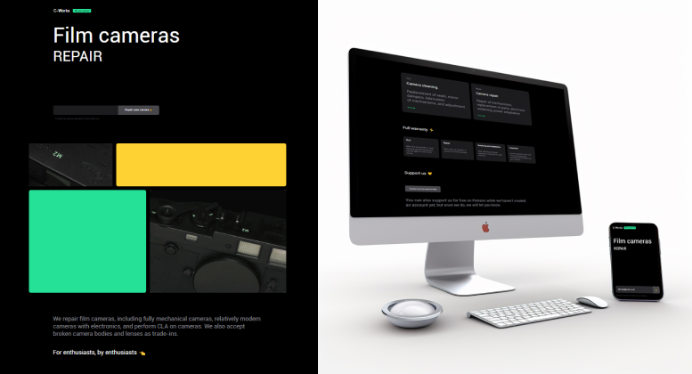

# Film camera repair

## [Project Link](https://sergeianokhin.github.io/camera-repair/index.html)

## Tech Stack

HTML, CSS, SCSS, BEM, JavaScript

## Main goal

Practicing in responsive layout using preprocessor SCSS

## Description

This project is individual practical work demonstrates **responsive layout for different devices.** 

The project are used:
 - semantic markup
 - BEM methodology
 - CSS flexbox layout
 - SCSS preprocessor
 - JavaScript for demonstrate sending email option with simple email  input validation

## Setup

There are two options:

- Run index.html using your browser
- Download project or use git clone. Than run the project from you IDE. You can use LiveServer extension for VS Code for example

